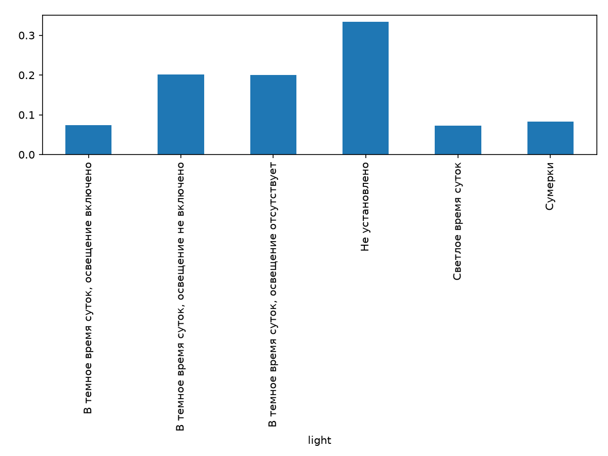
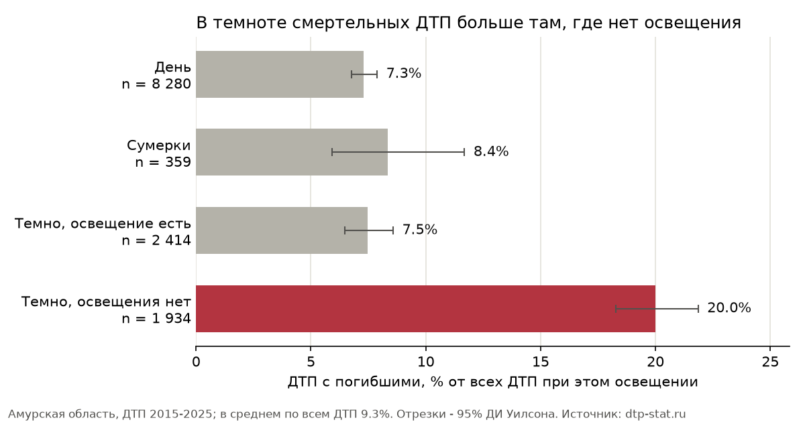

# Анализ данных о ДТП: Амурская область

Автор / GitHub: axonde · Регион: Амурская область · Период: 01.01.2015 - 31.01.2026 (в расчётах - полные годы 2015-2025)

Главный вопрос исследования: **в каких условиях ДТП в Амурской области чаще заканчиваются гибелью людей** - где, когда и при каком освещении. Все графики находятся в дашборде (`make run`), ниже на них ссылаюсь по названиям вкладок и номерам графиков.

## Данные и подготовка

**Источник.** «Карта ДТП», открытые данные: https://dtp-stat.ru/opendata/. Файл `amurskaia-oblast.geojson` из архива `amurskaia-oblast.geojson.zip`, скачан и импортирован 26.09.2026. SHA-256: `bf6dbcfc8cd66dff1e8f7c2ec520d27fc96154da9ba66e72555cf4db88e9d9af`, 13 040 записей.

**Единица анализа - одно ДТП** (одна запись GeoJSON). Участников и транспорт в отдельные строки не разворачиваю: из вложенных списков беру только признаки уровня ДТП (число ТС, есть ли мотоцикл или грузовик, место, погода). Поэтому каждое ДТП учитывается ровно один раз.

**Период.** Данные есть с 01.01.2015 по 31.01.2026. От 2026 года есть только январь, поэтому годовые сравнения, тесты и проекции считаю по полным годам 2015-2025: **12 990 ДТП**. Дашборд по умолчанию показывает этот же период, январь 2026 можно добавить фильтром.

**Поля и показатели.**

| Поле | Что это | Как используется |
|---|---|---|
| `datetime` | дата и время ДТП | год, месяц, час, день недели; зима = декабрь-февраль, лето = июнь-август |
| `region` | район или город | `district` - название района или города; `area_type` - Благовещенск / другие города / районы |
| `category` | тип ДТП | 7 частых типов и «Прочие» |
| `light` | освещение | 4 группы: день, сумерки, темно и освещение есть, темно и освещения нет |
| `dead_count`, `injured_count`, `severity` | последствия | ДТП с погибшими = `dead_count > 0` (совпадает с `severity = «С погибшими»`); пострадавшие = раненые + погибшие |
| `nearby`, `weather`, `vehicles` | вложенные списки | перегон, перекрёсток, пешеходный переход, осадки или туман, число ТС, мотоцикл/мопед, грузовик |
| `geometry.coordinates` | долгота и широта | карта |

Главный показатель - **доля ДТП с погибшими** (т.е. >= 1 человека) делённое на все ДТП группы, в процентах. Проценты везде считаются от числа ДТП в группе. Второй показатель - **погибших на 100 ДТП** (гипотеза H3). Всего за 2015-2025: 1 202 ДТП с погибшими (9.3%), 1 407 погибших и 16 892 раненых.

**Проверка качества.**

| Что проверено | Что найдено | Что сделано |
|---|---|---|
| Даты | все 13 040 распознаны | - |
| Дубликаты | повторных `id` и номеров ГИБДД нет; одна пара ДТП с одинаковыми временем и координатами, но у обеих координаты (0, 0) и разные адреса | ничего не удалено: это разные ДТП |
| Территория | у 2 224 ДТП в `region` стоит «Амурская область», а `parent_region` пустой. По адресам это Белогорск, Свободный, Тында, Зея, Шимановск и городок Серышево-4 - города областного значения, у которых нет района | объединены с Райчихинском и Углегорском в группу «Другие города» |
| Названия | «7 - Завитинский район» | переименован в «Завитинский район» |
| Освещение | 3 ДТП с «Не установлено»; «освещение не включено» (170 ДТП) и «отсутствует» (1 771) дают почти одинаковую долю ДТП с погибшими (20.0% и 19.9%) | 3 ДТП исключены из графиков и теста по освещению, две группы объединены в «Темно, освещения нет» |
| Координаты | 1 ДТП без координат, 203 с (0, 0), 64 вне границ области (например, широта 12, долгота 48); перепутанных широты и долготы нет; все ошибки в 2015-2018 гг. | 268 ДТП (2.1%) не показываю на карте, в остальных расчётах они участвуют |
| Необычные значения | ДТП с 52 участниками и 49 ранеными (16.10.2025, подъезд к Свободному, столкновение); максимум погибших в одном ДТП - 6 | оставлены: это реальные события, а в долях каждое ДТП весит одинаково |
| Полнота периода | все 133 месяца есть, пустых нет; меньше всего ДТП в январе 2025 (37), январь 2026 (50) в пределах обычного разброса | - |
| Адрес | пуст у 747 ДТП | адрес не использую |

## Визуализации и исследовательские вопросы

В дашборде 12 визуализаций. Числа ниже - по ДТП 2015-2025.

| № | Вкладка и график | Тип | Что видно |
|---|---|---|---|
| 1 | Обзор → «Число ДТП по месяцам» | временной ряд | в 2015 г. 1 390 ДТП, в 2025 г. 1 073 (−23%); сильная сезонность: в июле в среднем 138 ДТП, в феврале 60 |
| 2 | Обзор → «Типы ДТП» | столбчатая | столкновения 39%, наезды на пешеходов 23%, съезды с дороги 11%, опрокидывания 10%. Самая высокая доля с погибшими у наездов на стоящее ТС (18.8%) и опрокидываний (12.1%) |
| 3 | Обзор → «Сколько человек пострадало в одном ДТП» | гистограмма | 74.7% ДТП - один пострадавший, 16.6% - двое, максимум 50 |
| 4 | Обзор → «Когда происходят ДТП» | heatmap | пик в будни в 17-18 ч (максимум - пятница, 17 ч, 164 ДТП за 11 лет). Ночью ДТП мало, но в ночи на субботу и воскресенье их больше |
| 5 | Тяжесть → «Благовещенск, другие города и районы» | сравнение групп с 95% ДИ + таблица районов | доля ДТП с погибшими: Благовещенск 3.0% (n = 4 455), другие города 6.9% (2 545), районы 14.9% (5 990). Среди районов - от 7.8% (Завитинский) до 23.0% (Шимановский) |
| 6 | Тяжесть → «В какое время суток ДТП смертельнее?» | столбцы с ДИ, **свой вопрос 1** | с 21 до 6 ч доля 14.4% (n = 3 071), с 7 до 20 ч - 7.7% (n = 9 919) |
| 7 | Тяжесть → «Темнота или отсутствие освещения?» | столбцы с ДИ, **свой вопрос 2, возник из графика 6** | день 7.3%, сумерки 8.4%, темно и освещение есть 7.5%, темно и освещения нет 20.0%. Есть переключатель разбивки по типу территории |
| 8 | Тяжесть → «Зимой ДТП меньше, но тяжелее ли они?» | два графика: число ДТП и доля с погибшими по месяцам, **свой вопрос 3** | зимой 72 ДТП в месяц, летом 125; доля с погибшими по месяцам меняется от 7.6% (январь) до 11.0% (сентябрь) без зимнего подъёма |
| 9 | Карта → «Точки» | точечная карта | ДТП вдоль дорог, больше всего - в Благовещенске |
| 10 | Карта → «Сетка» | агрегированная карта | число ДТП и доля ДТП с погибшими по ячейкам 0.25° |
| 11 | PCA и t-SNE → PCA | проекция | ось «город ↔ трасса» |
| 12 | PCA и t-SNE → t-SNE | два запуска, perplexity 30 и 5 | устойчивые группы по типу ДТП и территории |

Все графики вкладок «Обзор», «Тяжесть» и «Карта» пересчитываются при смене периода и фильтров (тип территории, район или город, тип ДТП).

**Как один вопрос вёл к другому.**

1. График 5: в районах доля ДТП с погибшими в 5 раз выше, чем в Благовещенске. Отсюда гипотеза H2.
2. График 6: ночью доля почти вдвое выше, чем днём. Возник вопрос: это из-за темноты или из-за того, что дорога не освещена?
3. График 7 отвечает: в целом освещённая темнота похожа на день (7.5% и 7.3%), а без освещения доля в 2.7 раза выше (20.0%). Отсюда гипотеза H1.
4. Неосвещённые дороги в основном в районах: 84% неосвещённых ДТП произошли там. Значит, эффект освещения мог оказаться просто эффектом территории. Разбивка графика 7 по территориям это проверяет: темнота без освещения опаснее освещённой темноты в каждой группе. В Благовещенске 10.2% против 4.8% (n = 128 и 1 248), в других городах 20.1% против 8.7% (189 и 682), в районах 20.8% против 12.6% (1 617 и 484). Разбивка показала и обратное: сходство освещённой темноты с днём во многом объясняется составом групп. Освещённые улицы в основном в городах, где ДТП в любое время легче. Внутри Благовещенска темнота опаснее дня даже при фонарях (4.8% против 2.0%).
5. Отдельный вопрос, который прямо задан в условии: как меняется картина зимой? На графике 8 зимой ДТП меньше, а доля с погибшими не растёт. Отсюда гипотеза H3.

## Статистические гипотезы

Общие условия: единица - одно ДТП 2015-2025 гг., каждое ДТП входит в одну группу один раз. ДТП считаю независимыми друг от друга. Это допущение: ДТП на одной опасной дороге могут быть похожи. Уровень значимости α = 0.05; с поправкой Бонферрони на три проверки - 0.017, выводы от этого не меняются. Расчёт - `solution/research.py`, результаты показаны во вкладке «Гипотезы».

### H1. Освещение в тёмное время

- **Вопрос:** в темноте без освещения ДТП чаще заканчиваются гибелью, чем при включённом освещении?
- **Группы:** ДТП в тёмное время суток. Освещения нет (отсутствует или не включено): n = 1 934, из них 387 с погибшими. Освещение есть: n = 2 414, из них 180.
- **H0:** доля ДТП с погибшими в двух группах одинакова, исход не зависит от освещения. **H1:** доли различаются (двусторонняя альтернатива).
- **Тест:** χ² Пирсона для таблицы 2×2 (освещение × есть ли погибшие), без поправки Йейтса. Применим: признаки категориальные, каждое ДТП попадает в одну ячейку, наименьшая ожидаемая частота 252 (нужно хотя бы 5).
- **Эффект:** 20.0% − 7.5% = **+12.6 п.п.**, без освещения доля в 2.7 раза выше.
- **95% ДИ разности:** [+10.5; +14.6] п.п., нормальное приближение (Вальд).
- **Результат:** χ² = 149.2, df = 1, p ≈ 3·10⁻³⁴ (< 0.001). H0 отвергаем.
- **Вывод:** в темноте без освещения доля ДТП с погибшими заметно выше. Разрыв сохраняется внутри каждого типа территории (п. 4 выше). В районах он меньше, около 8 п.п., поэтому общая оценка 12.6 п.п. частично включает эффект территории. Это наблюдение, а не доказательство причины: неосвещённые участки - это ещё и трассы с высокой скоростью и без тротуаров. Гипотеза возникла после просмотра графика 6, поэтому p-value немного оптимистичен, но эффект очень большой.

### H2. Районы и Благовещенск

- **Вопрос:** отличается ли доля ДТП с погибшими в районах и в областном центре?
- **Группы:** районы n = 5 990 (892 с погибшими), Благовещенск n = 4 455 (135). Другие города в сравнение не входят, это промежуточная группа (6.9%).
- **H0:** метка «районы / Благовещенск» не связана с тем, погиб ли кто-то в ДТП, доли одинаковы. **H1:** доли различаются.
- **Тест:** перестановочный тест (`scipy.stats.permutation_test`), 9 999 перестановок меток, статистика - разность долей. Если H0 верна, метка не несёт информации об исходе. Тогда ДТП обменны: любое перераспределение меток между ними так же вероятно, как наблюдаемое.
- **Эффект:** 14.9% − 3.0% = **+11.9 п.п.**, в районах доля в 4.9 раза выше.
- **95% ДИ разности:** [+10.8; +12.9] п.п., перцентильный bootstrap: 9 999 повторов, ДТП пересэмплируются внутри каждой группы.
- **Результат:** p = 0.0002 - минимально возможное значение при 9 999 перестановках: ни одна перестановка не дала разницы такой величины. H0 отвергаем.
- **Вывод:** в районах ДТП гораздо чаще смертельные. На районы приходится 46% всех ДТП и 74% ДТП с погибшими, на Благовещенск - 34% ДТП и только 11% ДТП с погибшими. Возможные причины (скорость на трассах, неосвещённые перегоны, дальше до больницы) по выгрузке не проверяются.

### H3. Зима и лето

- **Вопрос:** зимой ДТП тяжелее, чем летом? Так часто думают из-за гололёда, мороза и ранней темноты.
- **Группы:** зима (декабрь-февраль) n = 2 391, лето (июнь-август) n = 4 127.
- **Показатель:** погибших на 100 ДТП (среднее `dead_count` × 100).
- **H0:** среднее число погибших на 100 ДТП зимой и летом одинаково. **H1:** различается.
- **Тест:** t-тест Уэлча (`scipy.stats.ttest_ind`, `equal_var=False`). Признак дискретный и скошенный: в 91% ДТП погибших нет. Но группы большие, и распределение среднего близко к нормальному (ЦПТ). Равенство дисперсий не предполагается.
- **Эффект:** 10.0 − 10.2 = **−0.2** погибших на 100 ДТП.
- **95% ДИ разности:** [−2.0; +1.6], t-распределение с поправкой Уэлча.
- **Результат:** t = −0.17, p = 0.86. H0 не отвергаем.
- **Вывод:** различия в тяжести между зимой и летом не видно. Доля ДТП с погибшими тоже почти одинакова: 8.7% и 8.6%. Это не доказывает равенство, но ДИ показывает: если разница есть, она не больше примерно 2 погибших на 100 ДТП. При этом ДТП зимой в месяц на 42% меньше (72 против 125). По выгрузке нельзя сказать, связано ли это с меньшим числом поездок, потому что данных о потоке нет.

### Сводка

| | Группы (n) | Эффект | 95% ДИ | Тест | p-value | Вывод |
|---|---|---|---|---|---|---|
| H1 | темно без освещения (1 934) и с освещением (2 414) | +12.6 п.п. доли ДТП с погибшими | [10.5; 14.6], Вальд | χ² 2×2 | < 0.001 | H0 отвергаем |
| H2 | районы (5 990) и Благовещенск (4 455) | +11.9 п.п. доли ДТП с погибшими | [10.8; 12.9], bootstrap | перестановочный | 0.0002 | H0 отвергаем |
| H3 | зима (2 391) и лето (4 127) | −0.2 погибших на 100 ДТП | [−2.0; +1.6], Уэлч | t-тест Уэлча | 0.86 | H0 не отвергаем |

Использованы три разных теста; перестановочный тест и bootstrap - в H2.

## Карты и проекции

**География.** В GeoJSON координаты записаны как [долгота, широта]. Они совпадают с `properties.point`. Медианные координаты ДТП по городам из адресов совпадают с реальным положением городов: например, Благовещенск - 50.28° с. ш., 127.54° в. д., Тында - 55.15° с. ш., 124.73° в. д. Точку считаю ошибочной, если она без координат, равна (0, 0) или лежит вне прямоугольника 48.8-57.2° с. ш. и 119.5-135.2° в. д. Прямоугольник грубый и захватывает часть соседних регионов, но явные ошибки отсекает. Не удалось отобразить **268 из 13 040 ДТП (2.1%)**: 1 без координат, 203 с (0, 0), 64 вне области. Все ошибки - за 2015-2018 гг. Перепутанных широты и долготы нет.

Карта во вкладке «Карта» переключается между тремя видами: точки (цвет - последствия, при более чем 5 000 точек берётся случайная подвыборка с seed 42), сетка с числом ДТП и сетка с долей ДТП с погибшими. Размер ячейки по умолчанию 0.25°, это около 28 км с севера на юг и 17 км с запада на восток; можно выбрать 0.1° или 0.5°. При 0.1° в районах много ячеек с 1-3 ДТП и доля получается шумной, при 0.5° город сливается с пригородами. Число ДТП показано 5 классами (1-4, 5-19, 20-99, 100-499, 500+), потому что город и сёла отличаются в сотни раз. Долю показываю только для ячеек, где не меньше 20 ДТП (порог можно менять), шкала 0-30%. Подложка © OpenStreetMap contributors.

**Пространственная закономерность.** Одна ячейка с Благовещенском даёт почти 30% всех ДТП (около 3 800), но с погибшими там только 3%. Ячейки с долей 20-30% лежат вне городов, цепочкой вдоль федеральной трассы Р-297 «Амур» (Сковородино - Магдагачи - Шимановск - Свободный) и на дорогах между райцентрами. Карта концентрации ДТП и карта их тяжести почти противоположны. Это пространственная сторона гипотез H2 и H1: за городом больше неосвещённых перегонов. Это показывает, где ДТП тяжелее, но не риск поездки: для него нужен поток машин.

**PCA.** Объекты - 3 000 случайных ДТП 2015-2025 гг. (seed 42), без 3 ДТП с неустановленным освещением. Близость двух точек означает, что ДТП похожи по условиям. Признаки (25 штук):

- one-hot кодирование типа ДТП (8), освещения (4) и типа территории (3). Номера категорий не использую, они задали бы произвольные расстояния;
- флаги: перегон, перекрёсток, пешеходный переход, осадки или туман, мотоцикл или мопед, грузовик, зима, выходной;
- числовые признаки: число ТС и число участников.

Исход (погибшие, раненые) в признаки не входит, им точки только раскрашиваются. Все признаки стандартизованы (`StandardScaler`). PC1 объясняет 13.9% дисперсии, PC2 - 10.1%, вместе **23.9%**. Для бинарных признаков это обычно: проекция передаёт главное направление, но не всю структуру.

**PC1 - ось «город ↔ трасса».** Отрицательные веса: перекрёсток (−0.36), Благовещенск (−0.34), столкновение (−0.31), число ТС (−0.28), пешеходный переход (−0.24). Положительные: районы (+0.39), перегон (+0.34), темно без освещения (+0.25), съезд с дороги (+0.22), опрокидывание (+0.22). Среднее значение PC1 у ДТП с погибшими +0.99, у ДТП с лёгкими последствиями −0.17. Среди ДТП с PC1 > 1 доля с погибшими 15.7%, у остальных 6.3%. PC2 отделяет столкновения нескольких машин, в том числе с грузовиками, от наездов на пешеходов у переходов.

**t-SNE.** Те же 3 000 ДТП и те же стандартизованные признаки. Запуск 1: `perplexity=30`, `init="pca"`, `random_state=42`. Запуск 2: `perplexity=5`, остальное так же. Прочие параметры - по умолчанию scikit-learn 1.9.1.

- При perplexity 30 точки собираются в несколько десятков плотных островков. Каждый островок - ДТП почти с одинаковым набором условий: один тип ДТП, одна территория, одно освещение. Островки одного типа лежат рядом.
- При perplexity 5 островки не отделяются, получается одно облако, но те же области по типу ДТП и территории в нём видны.

Проверка по исходным признакам: сколько процентов из 10 ближайших соседей точки на проекции совпадают с ней по признаку.

| Проекция | Тип ДТП | Территория | Освещение | Есть погибшие |
|---|---|---|---|---|
| PCA | 76 | 80 | 78 | 85 |
| t-SNE, perplexity 30 | 98 | 95 | 98 | 85 |
| t-SNE, perplexity 5 | 97 | 93 | 96 | 85 |
| случайные соседи | 24 | 37 | 46 | 83 |

Что дали проекции:

- ДТП - это набор повторяющихся сценариев вида «тип × территория × освещение»; это деление устойчиво к perplexity, а число и форма островков - нет.
- ДТП с погибшими не образуют отдельной группы: по исходу соседи совпадают почти как случайные (85% при 83%). Условия повышают вероятность гибели, как в H1 и H2, но не определяют исход.

Размеры пятен и расстояния между островками не интерпретирую.

## График до и после

Выбран график 7 - доля ДТП с погибшими при разном освещении (все ДТП 2015-2025). Вопрос и метрика не менялись.

| До | После |
|---|---|
|  |  |

Что изменилось:

- длинные повёрнутые подписи категорий заменены короткими горизонтальными, под каждой - размер группы;
- группы идут по смыслу, от дня к полной темноте, а не по алфавиту;
- доли переведены в проценты, у оси есть подпись с единицами, у каждого столбца 95% ДИ Уилсона;
- убран столбец «Не установлено»: 3 ДТП давали самый высокий столбец (33%) и сбивали с толку; «освещение не включено» объединено с «отсутствует»;
- все группы серые, одна выделена цветом; в заголовке сформулирован вывод, внизу указаны источник, период и средняя доля.

Что стало легче увидеть: на графике «до» главным выглядел случайный столбец из 3 ДТП, а разницу между освещённой и неосвещённой темнотой приходилось искать в подписях. На графике «после» сразу видно, что без освещения доля ДТП с погибшими 20.0%. Это в 2.7 раза больше, чем в темноте при освещении, и больше, чем в любой другой группе. Интервалы показывают, что для сумерек данных мало.

## Итог

**Три главных вывода** (все ДТП 2015-2025, n = 12 990):

1. **Большинство ДТП происходит в городах, большинство смертей - вне их.** В Благовещенске 34% ДТП, но с погибшими из них только 3.0%. В районах 14.9%: +11.9 п.п., 95% ДИ [10.8; 12.9], перестановочный тест p < 0.001. На районы приходится 74% всех ДТП с погибшими (график 5, карта, H2).
2. **Самое опасное условие - темнота без освещения.** Ночью доля ДТП с погибшими почти вдвое выше, чем днём. В темноте без освещения она 20.0%, при включённом освещении 7.5%: +12.6 п.п., 95% ДИ [10.5; 14.6], χ² p < 0.001. Разрыв есть в каждом типе территории (графики 6-7, H1).
3. **Зима уменьшает число ДТП, но не их тяжесть.** Зимой ДТП в месяц на 42% меньше, чем летом, а погибших на 100 ДТП столько же: 10.0 и 10.2, разница −0.2, 95% ДИ [−2.0; +1.6], p = 0.86 (график 8, H3).

Это наблюдения. Возможные причины - скорость на трассах, отсутствие фонарей и тротуаров, меньше поездок зимой. По этим данным их проверить нельзя.

**Что изучить дальше.** Наезды на пешеходов в районах в темноте без освещения: примерно каждый третий такой наезд заканчивается гибелью (32.5% ДТП с погибшими, n = 338). Для сравнения: при освещении в районах 13.8% (n = 145), днём 10.3% (n = 301). На это указывают H1 (эффект освещения) и карта: смертельные ячейки идут вдоль трассы, через сёла. Следующий шаг - найти участки, где такие ДТП повторяются, и сопоставить их с данными об освещении, тротуарах и потоке машин.

**Ограничения.**

- В выгрузке только ДТП с пострадавшими, ДТП без пострадавших нет.
- Нет данных о транспортном потоке, поэтому можно сравнивать число и тяжесть ДТП, но не риск поездки. Например, «зимой ДТП меньше» не значит «зимой ездить безопаснее».
- Освещение, территория, тип дороги и скорость связаны между собой. Разбивка по типу территории - только первый шаг; остальные смешивающие факторы не учтены.
- Гипотезы H1 и H2 появились после просмотра графиков, поэтому их p-value оптимистичны. Эффекты при этом большие и устойчивые.
- ДТП считаются независимыми; координаты проверены грубо, прямоугольником; проекции построены на подвыборке из 3 000 ДТП.

## Воспроизведение

```bash
make install
.venv/bin/python data/import_data.py /path/to/amurskaia-oblast.geojson.zip
.venv/bin/python solution/research.py
make run
```

- `research.py` печатает все числа гипотез и заново сохраняет картинки «до/после» в `solution/assets/`.
- Дашборд считает гипотезы и проекции сам при первом открытии (около 15 секунд), а потом берёт из кэша.
- Случайность везде зафиксирована seed 42: подвыборка точек карты, подвыборка для PCA/t-SNE, `random_state` t-SNE, перестановки и bootstrap.

Файлы:

- `app.py` - дашборд;
- `data_loading.py` - чтение выгрузки и признаки;
- `charts.py` - графики;
- `research.py` - гипотезы, PCA/t-SNE и график «до/после»;
- `assets/` - картинки «до/после».

Версии: Python 3.14.3, streamlit 1.64.0, pandas 3.0.6, numpy 2.5.3, scipy 1.18.1, statsmodels 0.15.0, scikit-learn 1.9.1, plotly 6.9.0, matplotlib 3.11.2.
